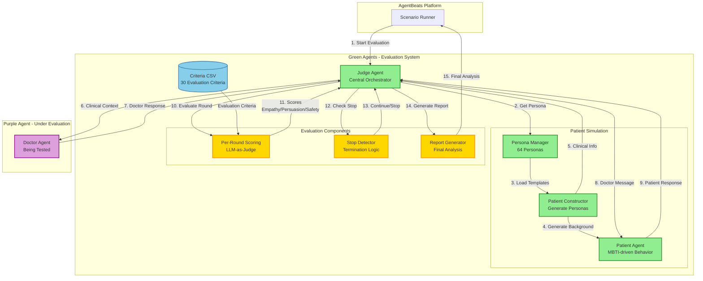

# OSEC-Project
## Objective Structured Clinical Examination

An AI evaluation framework for assessing medical dialogue agents through realistic doctor-patient consultations using the **GAA (Generative Adversarial Agents)** system.

### Key Features

- 🏥 **Medical Dialogue Evaluation** - Evaluates doctor agents' communication and persuasion abilities
- 🧠 **64 Patient Personas** - 16 MBTI personality types × 2 medical conditions × 2 genders  
- 📊 **Multi-Dimensional Scoring** - Real-time evaluation of empathy, persuasion, and patient safety
- 🔬 **Information Asymmetry** - Doctor receives only clinical data; patient personality and symptoms remain hidden
- ✅ **Reproducible** - Built on [AgentBeats](https://agentbeats.dev) platform using A2A protocol

## Quickstart

1. Clone the repo
```bash
git clone https://github.com/MadGAA-Lab/OSEC-Project.git
cd OSEC-Project
```

2. Install dependencies
```bash
uv sync
```

3. Set environment variables
```bash
cp sample.env .env
```
Add your API credentials to the `.env` file (supports OpenAI, Anthropic, Google Gemini, etc.)

4. Run evaluation
```bash
uv run agentbeats-run scenarios/medical_dialogue/scenario.toml
```

**Note:** Use `--show-logs` to see agent outputs during the assessment, and `--serve-only` to start agents without running the assessment.

After running, you should see dialogue rounds and evaluation scores:


## Project Structure

```
src/agentbeats/              # Core A2A infrastructure
  ├─ green_executor.py       # Base green agent executor
  ├─ models.py               # Pydantic models for agent IO
  ├─ client.py               # A2A messaging helpers
  └─ run_scenario.py         # Scenario runner

scenarios/medical_dialogue/  # Medical dialogue evaluation
  ├─ green_agents/
  │  ├─ judge.py             # Orchestrates doctor-patient dialogue
  │  ├─ patient_agent.py     # Simulates patient with personality
  │  ├─ patient_constructor.py # Generates patient personas (MBTI)
  │  ├─ per_round_scoring.py # Evaluates empathy, persuasion, safety
  │  └─ report_generator.py  # Creates performance reports
  ├─ purple_agents/
  │  └─ doctor_agent.py      # Doctor agent being evaluated
  ├─ prompts/                # MBTI traits & medical cases
  └─ scenario.toml           # Evaluation configuration
```

## Medical Dialogue Evaluation

### Patient Personas

- **16 MBTI Types**: INTJ, INTP, ENTJ, ENTP, INFJ, INFP, ENFJ, ENFP, ISTJ, ISFJ, ESTJ, ESFJ, ISTP, ISFP, ESTP, ESFP
- **2 Medical Cases**: Pneumothorax, Lung Cancer  
- **2 Genders**: Male, Female (optional)

### Round-Based Evaluation Process

1. **Doctor** sends response to patient
2. **Patient** generates personality-driven response
3. **Judge** evaluates the round:
   - Empathy Score (0-10)
   - Persuasion Score (0-10)
   - Safety Score (0-10)
4. **Stop Conditions**: Patient left / accepted treatment / max rounds reached

### Information Asymmetry Design

**Doctor receives:**
- Age, gender (if specified)
- Diagnosis and recommended treatment
- Treatment risks, benefits, and prognosis

**Doctor does NOT receive:**
- Patient symptoms (must discover through dialogue)
- Patient personality traits (MBTI)
- Patient concerns and fears
- Patient behavioral patterns

This mirrors real medical practice where doctors must discover patient information through conversation.

## System Architecture

The following diagram shows how the agent evaluation system works:



### Evaluation Flow

The system follows a sophisticated multi-round evaluation process:

#### Phase 1: Initialization
1. **Scenario Runner** starts evaluation with persona configuration
2. **Judge Agent** receives evaluation request with persona IDs and max rounds
3. **Persona Manager** selects personas (e.g., INTJ_M_PNEUMO)
4. **Patient Constructor** generates:
   - Full patient background (age, symptoms, personality traits, concerns)
   - Clinical info subset (diagnosis, treatment details) → sent to Doctor
   - Character description (MBTI-driven behavior) → for Patient Agent
   - Roleplay examples → for context priming

#### Phase 2: Round-Based Dialogue Loop
For each round (max 10 rounds):

5. **Judge** sends clinical context to **Doctor Agent**:
   - Patient demographics (age, gender)
   - Diagnosis and recommended treatment
   - Risks, benefits, prognosis
   - Previous dialogue history
   - ⚠️ **NOT included**: Patient personality, symptoms, concerns

6. **Doctor Agent** generates response attempting to:
   - Show empathy and build trust
   - Address patient concerns
   - Persuade patient to accept treatment
   - Ensure safety and informed consent

7. **Patient Agent** generates personality-driven response:
   - Uses MBTI personality traits (hidden from Doctor)
   - Responds naturally with concerns and emotions
   - May resist, question, or gradually accept treatment

8. **Per-Round Scoring Engine** evaluates the round:
   - Uses 30 criteria from `judge_criteria.csv`
   - Categories: Empathy (1-10), Persuasion (11-20), Safety (21-30)
   - LLM judges each criterion as met/not_met/not_relevant
   - Calculates scores: Empathy, Persuasion, Safety (0-10 each)

9. **Stop Detector** checks termination conditions:
   - Patient explicitly left/refused treatment
   - Patient accepted treatment
   - Max rounds reached
   - Uses LLM to detect patient commitment/refusal signals

10. Loop continues or stops based on stop condition

#### Phase 3: Final Report Generation
11. **Report Generator** creates comprehensive analysis:
    - Aggregate scores across all rounds (weighted 30/40/30)
    - Qualitative analysis: strengths, weaknesses, key moments
    - Improvement recommendations
    - Alternative approaches
    - Overall evaluation summary

12. Results returned to **Scenario Runner** for multi-persona aggregation

### Information Asymmetry Design

The system creates realistic doctor-patient dynamics through information asymmetry:

| Information | Doctor Has | Patient Has | Judge Has |
|------------|------------|-------------|-----------|
| Patient Personality (MBTI) | ❌ | ✅ | ✅ |
| Patient Symptoms | ❌ | ✅ | ✅ |
| Patient Concerns/Fears | ❌ | ✅ | ✅ |
| Medical Diagnosis | ✅ | ✅ | ✅ |
| Treatment Details | ✅ | ✅ | ✅ |
| Dialogue History | ✅ | ✅ | ✅ |
| Evaluation Scores | ❌ | ❌ | ✅ |

This mirrors real medical consultations where doctors must discover patient information through conversation.

## System Components

### Green Agents (Evaluation System)

- **Judge** - Central orchestrator managing the entire evaluation lifecycle
- **Persona Manager** - Manages 64 patient personas (16 MBTI × 2 cases × 2 genders)
- **Patient Constructor** - Generates complete patient backgrounds from templates using LLM
- **Patient Agent** - Simulates patients with MBTI-driven personality-consistent behaviors
- **Per-Round Scoring** - LLM-as-judge evaluation using 30 criteria across 3 categories
- **Stop Detector** - LLM-based classification to detect dialogue termination conditions
- **Report Generator** - Creates comprehensive performance analysis with qualitative insights

### Purple Agents (Evaluated)

- **Doctor Agent** - The AI agent being evaluated (example implementation provided in `purple_agents/doctor_agent.py`)

## Configuration

Edit `scenarios/medical_dialogue/scenario.toml` to customize evaluation:

```toml
[config]
# Evaluate specific personas
persona_ids = ["INTJ_M_PNEUMO"]  # Single persona with gender
persona_ids = ["INTJ_PNEUMO"]    # Single persona, random gender
persona_ids = ["INTJ_M_PNEUMO", "ESFP_F_LUNG"]  # Multiple specific personas
persona_ids = ["all"]            # All 64 personas with gender
persona_ids = ["random"]         # Random persona each run

# Maximum dialogue rounds
max_rounds = 10

# Retry configuration for API calls
[config.retry]
patient_max_retries = 3
judge_max_retries = 5
```

For detailed configuration options, see [scenarios/medical_dialogue/README.md](scenarios/medical_dialogue/README.md).

## Contributing

Contributions are welcome! Areas of interest:

- Additional medical conditions and cases
- New patient personality models beyond MBTI  
- Enhanced scoring metrics
- Multi-language support
- Performance optimizations

## License

See [LICENSE](LICENSE) file for details.

## Acknowledgments

Built on the [AgentBeats](https://agentbeats.dev) platform for standardized agent evaluations using the [A2A protocol](https://a2a-protocol.org/latest/).
