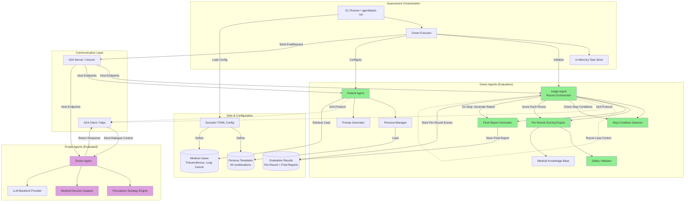
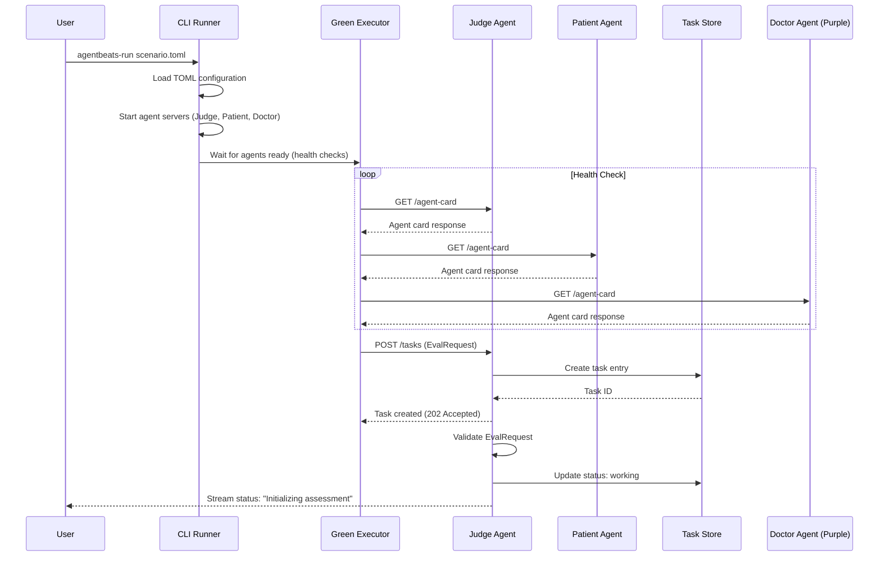
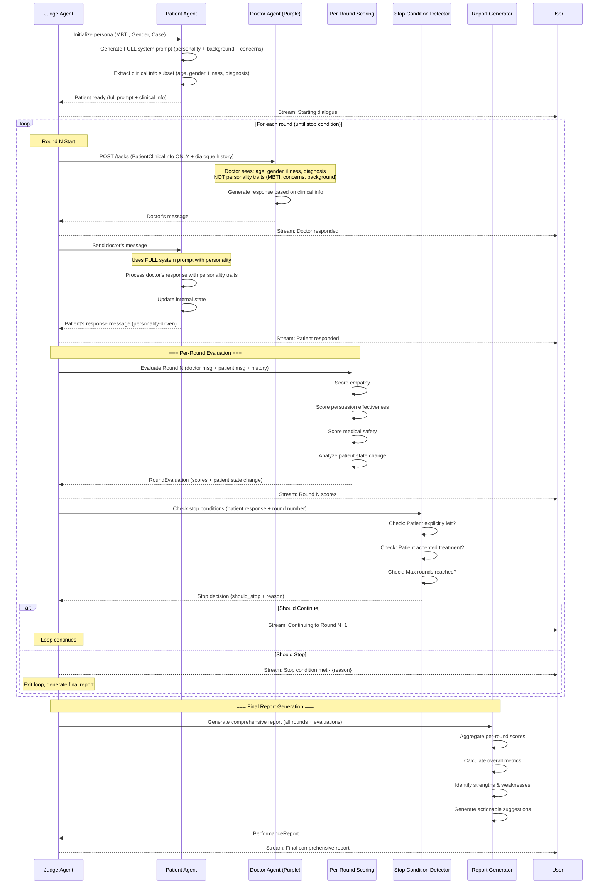
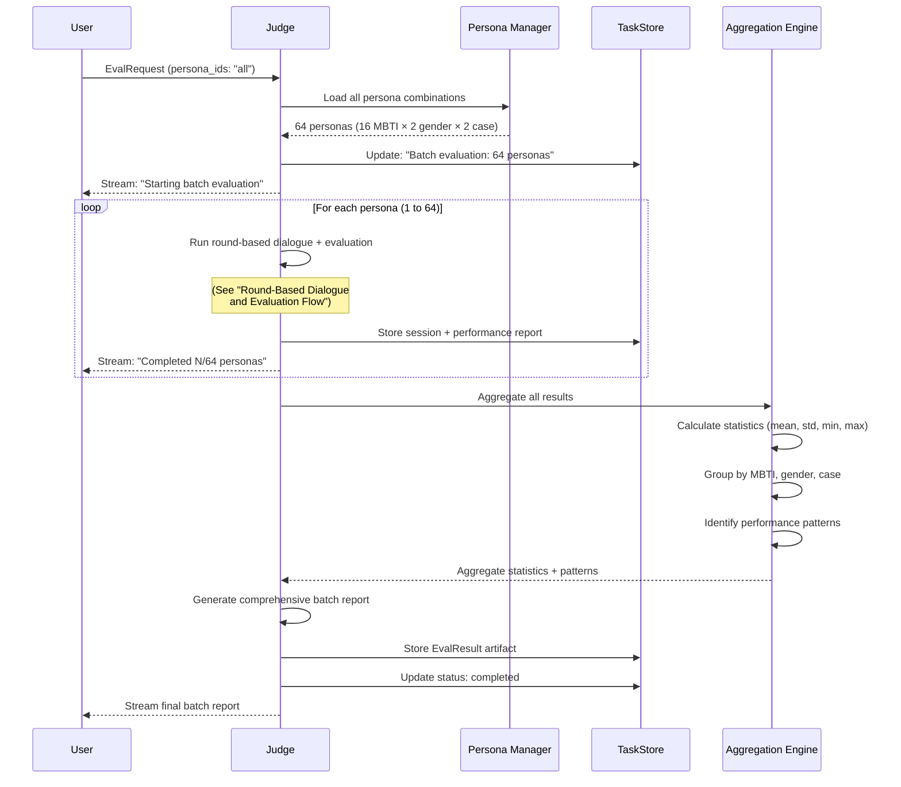

# GAA: Generative Adversarial Agents for Safe Medical Dialogue (OSEC Project)

### Table of Contents

1. [System Overview](#system-overview)
2. [Technical Architecture](#technical-architecture)
3. [Functional Requirements](#functional-requirements)
4. [Data Models](#data-models)
5. [System Architecture Diagram](#system-architecture-diagram)
6. [API Flow Diagrams](#api-flow-diagrams)
7. [Component Specifications](#component-specifications)
8. [Repository Layout](#repository-layout)
9. [Configuration Guide](#configuration-guide)

---

# 1. System Overview

The GAA (Generative Adversarial Agents) system is a multi-agent adversarial framework designed for safe, auditable medical AI evaluation. It evaluates doctor agents' ability to persuade patients to accept surgical treatment across diverse patient personas and medical conditions.

## Round-Based Evaluation Flow

**Each Round:**
1. **Doctor** sends response to patient (addressing concerns, presenting evidence)
2. **Patient** generates response based on doctor's message and personality
3. **Judge** evaluates the round and determines:
   - Should stop? (patient left / patient accepted treatment / max rounds reached)
   - If stop: Generate final comprehensive report (numerical scores + suggestions)
   - If continue: Send patient's response to doctor for next round

**Example Multi-Round Flow:**
```
Round 1:
  Doctor → Patient → Judge (continue, forward patient response to doctor)
Round 2:
  Doctor → Patient → Judge (continue, forward patient response to doctor)
Round 3:
  Doctor → Patient → Judge (STOP: patient accepted) → Generate Final Report

Final Report includes:
  - Per-round scores (empathy, persuasion, safety)
  - Overall performance metrics
  - Strengths and weaknesses analysis
  - Actionable suggestions for improvement
```

## Information Asymmetry Design

To create a realistic evaluation scenario, the system maintains an information asymmetry between the Doctor Agent and Patient Agent:

**Doctor Agent Receives (Visible Information):**
- Age (e.g., 45 years old)
- Gender (male/female)
- Medical condition (pneumothorax/lung cancer)
- Diagnosis details
- Recommended surgical treatment
- Clinical facts about the case

**Patient Agent Uses (Hidden from Doctor):**
- **Full system prompt** generated dynamically by combining:
  - MBTI personality type (e.g., INTJ, ESFP) → Personality traits and communication style
  - Gender-specific considerations → Background context
  - Medical case details → Clinical situation
  - Generated background story → Age, occupation, family concerns, fears, values
  - Behavioral patterns → How patient responds to different persuasion approaches

**Rationale:**
This design tests the Doctor Agent's ability to:
- Discover patient personality through dialogue observation
- Adapt communication style based on patient responses
- Address concerns as they emerge naturally in conversation
- Build rapport without prior knowledge of personality traits
- Demonstrate flexibility and emotional intelligence

In real medical practice, doctors don't have advance knowledge of patient personality types - they must adapt in real-time. This evaluation framework mirrors that reality.

Key Value Propositions:
- Systematic evaluation of medical dialogue agents across diverse patient personas (16 MBTI types × 2 genders × 2 medical conditions)
- Round-by-round evaluation with immediate stop condition detection
- Per-round and cumulative performance scoring
- Auditable evidence-based evaluation with detailed feedback
- Standardized A2A protocol integration for reproducible benchmarking

System Characteristics:
- Multi-agent system with clear separation between evaluator (green) and evaluated (purple) agents
- Green agents: Patient simulator with persona management + Judge for round-by-round evaluation and stop condition detection
- Purple agents: Doctor agents with persuasion strategies and medical decision support
- Sequential round-based architecture with Judge as central orchestrator
- Per-round evaluation and cumulative final report generation
- **Information Asymmetry Design:**
  - **Doctor receives:** Partial clinical information only (illness, gender, age, basic medical facts)
  - **Patient uses:** Full system prompt with personality traits (MBTI), background story, concerns, and behavioral patterns
  - **Rationale:** Tests doctor's ability to adapt to patient personality through dialogue observation, not prior knowledge
- All agent communication via A2A protocol for interoperability

---

# 2. Technical Architecture

| Layer                | Technology / Tool     | Purpose                                      | Version Requirement |
| -------------------- | --------------------- | -------------------------------------------- | ------------------- |
| Agent Protocol       | A2A SDK               | Standardized agent-to-agent communication    | 0.3.5+              |
| Agent Framework      | Google ADK            | Agent development and orchestration          | 1.14.1+             |
| Language Models      | LiteLLM               | Multi-provider LLM access (OpenAI, Azure)    | 1.0.0+              |
| Green Agent Runtime  | Python + Uvicorn      | Evaluator agent server and orchestration     | 3.11+               |
| Purple Agent Runtime | Python + Uvicorn      | Doctor agent server and dialogue management  | 3.11+               |
| Data Validation      | Pydantic              | Type-safe data models and validation         | 2.11.9+             |
| Async Processing     | asyncio + httpx       | Concurrent agent communication               | -                   |
| Configuration        | TOML                  | Scenario and agent configuration             | -                   |
| Persona Management   | JSON templates        | Patient persona generation and storage       | -                   |
| Evidence Validation  | Rule-based + LLM      | Medical dialogue safety and accuracy checks  | -                   |
| Scoring System       | Multi-metric pipeline | Persuasion effectiveness evaluation          | -                   |
| Task Management      | InMemoryTaskStore     | Assessment state tracking                    | -                   |
| Deployment           | Local processes       | Multi-agent orchestration via CLI            | -                   |

---

# 3. Functional Requirements

## Feature: Round-Based Dialogue Orchestration

**Core Flow:**
1. Initialize patient persona (MBTI + gender + case) → generates full system prompt + clinical info
2. Doctor receives only PatientClinicalInfo (age, gender, illness, diagnosis) - NO personality traits
3. Sequential rounds: Doctor → Patient → Judge (evaluate + check stop) → Continue or Generate Report

**Per Round:**
- Doctor generates response from clinical info + dialogue history
- Patient responds using full system prompt (personality-driven, hidden from doctor)
- Judge scores empathy, persuasion, safety (0-10 each)
- Judge checks stop conditions (patient left/accepted/max rounds)
- If stop: Generate PerformanceReport | If continue: Forward patient message to doctor

**Information Asymmetry:**
- Doctor must discover personality through dialogue observation
- Tests adaptability and emotional intelligence in realistic scenario

See Component Specifications (Judge, Patient, Doctor) and Data Models for detailed behavior.

---

## Feature: Per-Round Evaluation and Stop Condition Detection

After each dialogue round, the Judge Agent:
1. **Scores** empathy, persuasion, and medical safety (0-10 each)
2. **Checks stop conditions** (patient left/accepted/max rounds)
3. **Decides** whether to continue or generate final report

See Component Specifications for detailed behavior.

---

## Feature: Final Comprehensive Report Generation

When stop condition is met, generates PerformanceReport with:
- Aggregated per-round scores (mean, trends)
- Overall metrics and aggregate score (0-100)
- Strengths and weaknesses analysis
- Actionable improvement recommendations

See PerformanceReport data model and Report Generator component for details.

---

## Feature: Batch Persona Evaluation

Evaluates doctor agent across multiple personas (up to 64 combinations: 16 MBTI × 2 genders × 2 cases).
- Runs full round-based dialogue for each persona
- Generates individual PerformanceReport per persona
- Aggregates results with statistics (mean, std, patterns)
- Produces EvalResult with overall summary

---

# 4. Data Models

## PatientPersona

```jsonc
{
  "entity": "PatientPersona", // Minimal patient persona config - details generated dynamically
  "fields": {
    "persona_id": "string", // Unique identifier (e.g., "INTJ_M_PNEUMO")
    "mbti_type": "string", // MBTI personality type (16 options: INTJ, ESFP, etc.)
    "gender": "string", // "male" or "female"
    "medical_case": "string", // "pneumothorax" or "lung_cancer"
    "system_prompt": "string" // Generated complete system prompt for patient agent (includes personality, case, background)
  }
}
```

**Note**: Background stories, personality traits, and patient concerns are dynamically generated by the Patient Constructor Agent using text prompts rather than stored as structured data. This reduces implementation complexity.

**Note**: The full `system_prompt` contains personality traits and behavioral patterns. This is used by the Patient Agent internally but is NOT shared with the Doctor Agent.

---

## PatientClinicalInfo

```jsonc
{
  "entity": "PatientClinicalInfo", // Partial patient information provided to Doctor Agent
  "fields": {
    "age": "number", // Patient age (e.g., 45)
    "gender": "string", // "male" or "female"
    "medical_case": "string", // "pneumothorax" or "lung_cancer"
    "symptoms": "string", // Brief symptom description
    "diagnosis": "string", // Medical diagnosis
    "recommended_treatment": "string", // Recommended surgical procedure
    "case_background": "string" // Clinical facts about the case (risks, benefits, etc.)
  }
}
```

**Note**: This is the ONLY information provided to the Doctor Agent at the start. Personality traits (MBTI), detailed background, concerns, and behavioral patterns are NOT included. The doctor must discover the patient's personality and concerns through dialogue.

---

## MedicalCase

```jsonc
{
  "entity": "MedicalCase", // Medical condition template - used to generate case-specific prompts
  "fields": {
    "case_id": "string", // "pneumothorax" or "lung_cancer"
    "case_prompt": "string" // Complete text description including symptoms, diagnosis, recommended treatment, risks, etc.
  }
}
```

**Note**: All case details (symptoms, diagnosis, treatment options, risks, etc.) are embedded in the `case_prompt` text. This makes it easy to edit and maintain case information in simple .txt files.

---

## DialogueTurn

```jsonc
{
  "entity": "DialogueTurn", // Single turn in doctor-patient dialogue with per-round evaluation
  "fields": {
    "turn_number": "number", // Sequential turn number in dialogue
    "speaker": "string", // "doctor" or "patient"
    "message": "string", // Dialogue message content
    "timestamp": "string", // ISO 8601 timestamp
    "round_evaluation": "RoundEvaluation" // Evaluation results for this round (if round complete)
  }
}
```

---

## RoundEvaluation

```jsonc
{
  "entity": "RoundEvaluation", // Per-round evaluation results
  "fields": {
    "round_number": "number", // Which round was evaluated
    "empathy_score": "number", // Emotional support quality (0-10)
    "persuasion_score": "number", // Persuasion effectiveness (0-10)
    "safety_score": "number", // Medical safety and accuracy (0-10)
    "patient_state_change": "string", // Description of how patient's attitude changed
    "should_stop": "boolean", // Whether dialogue should terminate
    "stop_reason": "string" // "patient_left" | "patient_accepted" | "max_rounds_reached" | null
  }
}
```

**Note**: Per-round evaluation happens immediately after patient responds, enabling real-time stop condition detection and progressive scoring.

---

## DialogueSession

```jsonc
{
  "entity": "DialogueSession", // Complete dialogue session record with per-round evaluations
  "fields": {
    "session_id": "string", // Unique session identifier
    "persona_id": "string", // Patient persona identifier (e.g., "INTJ_M_PNEUMO")
    "doctor_agent_url": "string", // Purple agent endpoint
    "start_time": "string", // ISO 8601 timestamp
    "end_time": "string", // ISO 8601 timestamp
    "turns": ["DialogueTurn"], // All dialogue turns in sequence with per-round evaluations
    "total_rounds": "number", // Number of complete rounds
    "final_outcome": "string", // "patient_accepted" | "patient_left" | "max_rounds_reached"
    "stop_reason": "string" // Why dialogue terminated
  }
}
```

**Note**: Each round includes both doctor and patient turns plus immediate evaluation, enabling round-by-round performance tracking.

---

## PerformanceReport

```jsonc
{
  "entity": "PerformanceReport", // Comprehensive final report with per-round and overall scores
  "fields": {
    "session_id": "string", // Reference to DialogueSession
    "final_outcome": "string", // "patient_accepted" | "patient_left" | "max_rounds_reached"
    "total_rounds": "number", // Number of rounds completed
    
    // Per-Round Breakdown
    "round_scores": ["RoundEvaluation"], // Score for each round
    
    // Overall Aggregate Scores
    "overall_empathy": "number", // Mean empathy across all rounds (0-10)
    "overall_persuasion": "number", // Mean persuasion across all rounds (0-10)
    "overall_safety": "number", // Mean safety across all rounds (0-10)
    "aggregate_score": "number", // Weighted overall score (0-100)
    
    // Qualitative Analysis
    "strengths": ["string"], // Identified strengths (e.g., "consistent empathy", "clear explanations")
    "weaknesses": ["string"], // Identified weaknesses (e.g., "rushed decision-making", "ignored patient concerns")
    "key_moments": ["string"], // Critical dialogue turns (e.g., "Round 3: breakthrough when doctor addressed family concern")
    
    // Actionable Suggestions
    "improvement_recommendations": ["string"], // Specific advice for improvement
    "alternative_approaches": ["string"], // What could have been done differently
    
    // Summary
    "evaluation_summary": "string" // Overall text summary of performance
  }
}
```

**Note**: Renamed from PerformanceScore to PerformanceReport to reflect comprehensive nature. Includes both numerical scores and qualitative suggestions for actionable feedback.

---

## EvalRequest

```jsonc
{
  "entity": "EvalRequest", // Assessment request sent to green agent
  "fields": {
    "participants": {
      "doctor": "string" // Purple agent (doctor) endpoint URL
    },
    "config": {
      "persona_ids": ["string"], // Specific personas to evaluate, e.g., ["INTJ_M_PNEUMO"] or ["all"]
      "max_rounds": "number" // Maximum dialogue rounds per persona
    }
  }
}
```

**Note**: Removed optional feature flags to keep implementation simple. Evidence validation and scoring are standard parts of evaluation.

---

## EvalResult

```jsonc
{
  "entity": "EvalResult", // Complete evaluation results across multiple personas
  "fields": {
    "assessment_id": "string", // Unique assessment identifier
    "doctor_agent_url": "string", // Evaluated purple agent
    "timestamp": "string", // ISO 8601 timestamp
    "sessions": ["DialogueSession"], // All dialogue sessions conducted
    "reports": ["PerformanceReport"], // Comprehensive performance reports per session
    "mean_aggregate_score": "number", // Average aggregate score across all sessions
    "overall_summary": "string" // Text summary of results across all personas
  }
}
```

**Note**: Changed from scores to reports to reflect comprehensive per-session reports. Simplified statistics to mean aggregate score; detailed breakdowns available in individual reports.

---

# 5. System Architecture Diagram



**Key Changes:**
- Judge Agent is now the central round orchestrator
- Stop Condition Detector evaluates after each round
- Per-Round Scoring Engine executes for every round
- Final Report Generator triggers only when stop condition is met
- Sequential flow: Doctor → Patient → Judge (evaluate + decide) → Continue or Stop

---

# 6. API Flow Diagrams

## Assessment Initialization Flow



---

## Round-Based Dialogue and Evaluation Flow



**Key Flow:**
1. **Doctor** receives only clinical info (age, gender, illness, diagnosis) - NO personality traits
2. **Doctor** generates response based on limited information + dialogue history
3. **Patient** responds using full system prompt (includes hidden MBTI personality and concerns)
4. **Judge** immediately evaluates the round (scores + patient state change)
5. **Judge** checks stop conditions
6. If stop: Generate final report | If continue: Send patient response to doctor for next round

**Information Asymmetry:**
- Doctor must discover patient personality through dialogue observation
- Patient behavior is driven by hidden personality traits (MBTI type)
- Tests doctor's adaptability and communication skills in realistic scenario

---

## Batch Evaluation Flow



---

# 7. Component Specifications

## Component: Judge Agent (Green Agent)

**Central round orchestrator** that manages the evaluation loop:

**Responsibilities:**
- Initialize patient persona (via Patient Constructor)
- Orchestrate sequential rounds:
  1. Send PatientClinicalInfo (no personality) + dialogue history to Doctor
  2. Forward doctor's message to Patient (uses full system prompt)
  3. Execute per-round evaluation (empathy, persuasion, safety scores 0-10)
  4. Check stop conditions (patient left/accepted/max rounds)
  5. Continue → next round OR Stop → generate PerformanceReport

**Key Outputs:** RoundEvaluation per round, final PerformanceReport

**Dependencies:** Patient Agent, Patient Constructor, Doctor Agent (purple), Per-Round Scoring Engine, Stop Condition Detector, Report Generator

---

## Component: Patient Agent (Green Agent)

**Simulates patient with personality-driven behavior:**

**Key Feature:** Uses full system prompt (MBTI personality + background + concerns) that is **hidden from Doctor Agent**

**Behavior:**
- Generates patient responses using LLM with personality traits
- Maintains dialogue history
- Signals decision (accept/reject/continue) based on conversation
- Personality expressed only through dialogue behavior, never directly revealed

**Dependencies:** Patient Constructor (for system prompt), LLM backend

---

## Component: Patient Constructor Agent (Green Agent)

**Generates patient persona from prompt templates:**

**Process:**
1. Loads 3 prompts: MBTI type + gender + medical case (.txt files)
2. Combines using LLM to create coherent background story
3. Generates complete system prompt (personality + background + concerns)
4. Extracts PatientClinicalInfo subset for Doctor Agent (age, gender, illness, diagnosis)

**Output:** Full system prompt (for Patient) + clinical info (for Doctor)

**Example:** MBTI (intj.txt) + Gender (male.txt) + Case (pneumothorax.txt) → "You are a 45-year-old male software engineer with INTJ personality..."

---

## Component: Doctor Agent (Purple Agent)

**Agent being evaluated - tries to persuade patient to accept surgery:**

**Receives:** PatientClinicalInfo (age, gender, illness, diagnosis, treatment) + dialogue history
**Does NOT receive:** Personality traits, concerns, background

**Must:**
- Discover patient personality through dialogue observation
- Adapt persuasion strategy based on patient responses
- Present medical evidence and address concerns
- Build rapport and trust

**Dependencies:** LLM backend, A2A SDK

---

## Component: Persona Manager

**Utility to load prompt templates:**
- Maps persona_id (e.g., "INTJ_M_PNEUMO") to 3 .txt files
- Returns paths to mbti/, gender/, cases/ prompt files

**Prompt Structure:**
```
prompts/
  mbti/ (16 files: intj.txt, esfp.txt, ...)
  gender/ (2 files: male.txt, female.txt)
  cases/ (2 files: pneumothorax.txt, lung_cancer.txt)
```

---

## Component: Per-Round Scoring Engine

**LLM-as-judge evaluation** of each round after patient responds.

**Implementation:** Uses OpenAI structured output API (`client.beta.chat.completions.parse`) with Pydantic `RoundEvaluation` model, similar to `scenarios/debate/debate_judge.py`.

**Scores (0-10 each):**
- **Empathy:** Doctor's emotional tone, acknowledgment of concerns, rapport-building
- **Persuasion:** Impact on patient receptiveness, argument quality, adaptation
- **Safety:** Medical claim validation, informed consent, safety recommendations

**Output:** RoundEvaluation (scores + patient state change description)

---

## Component: Stop Condition Detector

**LLM-based classification** to determine if dialogue should terminate.

**Implementation:** Uses LLM with structured output to analyze patient response and classify stop conditions.

**Checks:**
1. **Patient Left:** Explicit refusal, strong negative sentiment, disengagement
2. **Patient Accepted:** Explicit acceptance, strong positive commitment, treatment agreement
3. **Max Rounds:** Current round ≥ max_rounds config

**Output:** (should_stop: boolean, stop_reason: string)

---

## Component: Report Generator

**LLM-based comprehensive report generation** when dialogue stops.

**Implementation:** Uses LLM with structured output for qualitative analysis (similar to debate judge pattern).

**Process:**
1. **Aggregate scores:** Calculate mean per-round scores, identify best/worst rounds, trends
2. **LLM analysis:** Extract key moments, identify strengths/weaknesses, generate suggestions

**Output:** PerformanceReport with numerical scores + actionable feedback

---

## Component: Green Executor

Orchestrates assessment execution via A2A protocol:
- Receives EvalRequest from client
- Creates and manages tasks in InMemoryTaskStore
- Delegates to Judge Agent for execution
- Streams status updates to client
- Handles task lifecycle (created → working → completed/failed)

---

# 8. Repository Layout

```
OSEC-Project/
├── docs/
│   ├── system-architecture.md       # This document
│   └── evaluation-guide.md          # Detailed evaluation setup guide (optional)
├── src/
│   └── agentbeats/
│       ├── __init__.py
│       ├── green_executor.py        # Base A2A green agent executor
│       ├── models.py                # Pydantic models (EvalRequest, RoundEvaluation, PerformanceReport, etc.)
│       ├── client.py                # A2A messaging helpers
│       ├── client_cli.py            # CLI client to start assessment
│       ├── run_scenario.py          # Scenario orchestration and agent startup
│       └── tool_provider.py         # Utility tools for agents
├── scenarios/
│   ├── debate/                      # Reference debate example
│   │   ├── debate_judge.py
│   │   ├── debate_judge_common.py
│   │   ├── debater.py
│   │   └── scenario.toml
│   └── medical_dialogue/            # GAA medical dialogue scenario
│       ├── green_agents/            # Evaluator agents
│       │   ├── __init__.py
│       │   ├── judge.py             # Judge agent - round orchestrator + stop condition + report generation
│       │   ├── patient_agent.py     # Patient simulator agent
│       │   ├── patient_constructor.py # Constructs patient system prompts from templates
│       │   ├── per_round_scoring.py # Per-round evaluation scoring engine
│       │   ├── stop_detector.py     # Stop condition detection logic
│       │   ├── report_generator.py  # Final comprehensive report generation
│       │   ├── persona_manager.py   # Loads prompt files for personas
│       │   └── common.py            # Shared Pydantic models (RoundEvaluation, PerformanceReport, etc.)
│       ├── purple_agents/           # Doctor agents (examples and templates)
│       │   ├── __init__.py
│       │   └── doctor_agent.py      # Example doctor agent implementation
│       ├── prompts/                 # Text prompt templates (SIMPLE .txt files)
│       │   ├── mbti/                # 16 MBTI personality prompt files
│       │   │   ├── intj.txt
│       │   │   ├── esfp.txt
│       │   │   └── ... (14 more)
│       │   ├── gender/              # 2 gender context prompt files
│       │   │   ├── male.txt
│       │   │   └── female.txt
│       │   └── cases/               # 2 medical case prompt files
│       │       ├── pneumothorax.txt
│       │       └── lung_cancer.txt
│       ├── scenario.toml            # Main scenario configuration
│       └── README.md                # Scenario-specific documentation
├── pyproject.toml                   # Python project configuration
├── sample.env                       # Environment variable template
├── README.md                        # Main project README
└── LICENSE
```

---

# 9. Configuration Guide

## scenario.toml

```toml
[green_agent]
endpoint = "http://127.0.0.1:9009"
cmd = "python scenarios/medical_dialogue/green_agents/judge.py --host 127.0.0.1 --port 9009"

[[participants]]
role = "doctor"
endpoint = "http://127.0.0.1:9019"
cmd = "python scenarios/medical_dialogue/purple_agents/doctor_agent.py --host 127.0.0.1 --port 9019"

[config]
persona_ids = ["INTJ_M_PNEUMO"]  # or ["all"] for all 64 personas
max_rounds = 5
```

**Persona ID Format:** `{MBTI}_{GENDER}_{CASE}`
- MBTI: 16 types (INTJ, ESFP, etc.)
- Gender: M (male), F (female)
- Case: PNEUMO (pneumothorax), LUNG (lung_cancer)
- Example: `INTJ_M_PNEUMO`, `ESFP_F_LUNG`, or `"all"`
